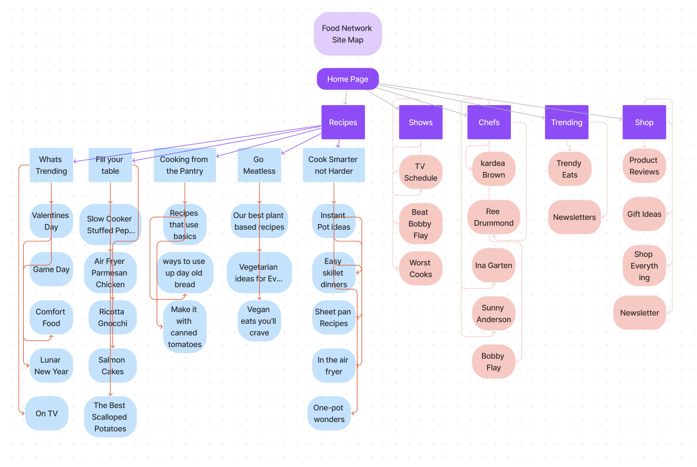
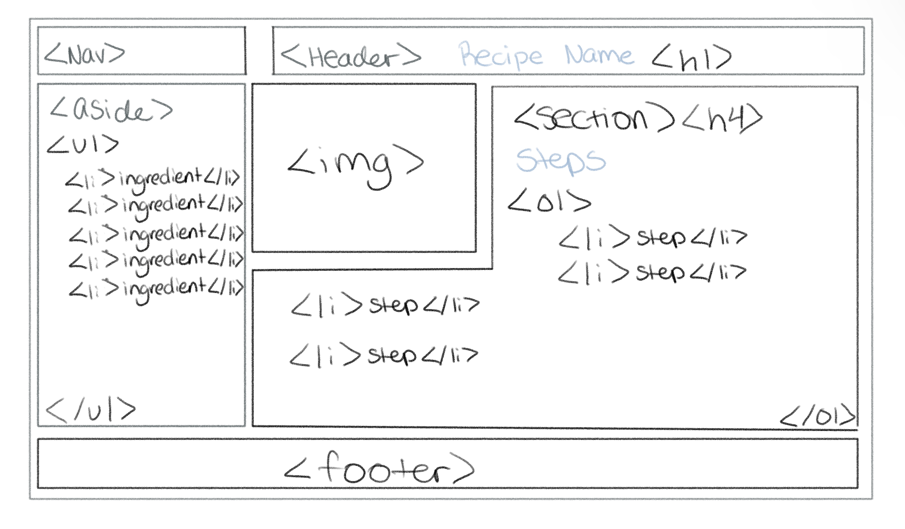

# Homework 2 Due 2/5
1. 
2. After reading the artilce I realized that it is important to consider the user before creating a website and to use differnet tools and methods in order to make the website inclusive with its creators and users. Wireframing is highlighted as a powerful tool as it helps give an idea of what the project will look like as well as makes it easier to break down the project into sections to consider limitations or adjustments that need to be made. 
3. 